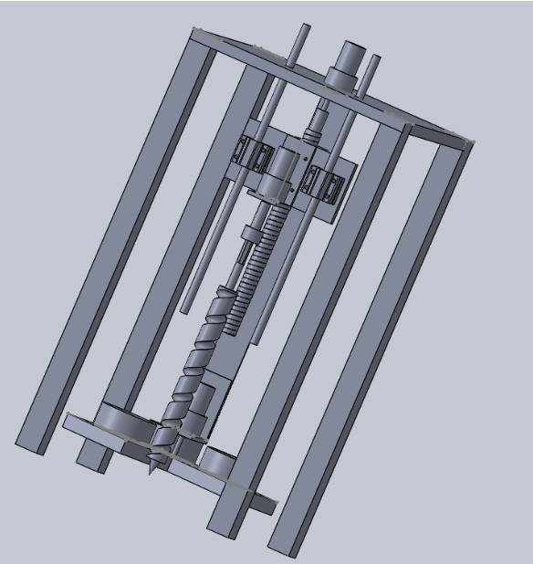

# Rover Soil Collection Mechanism

An soil sampling module designed to be mounted on a planetary or terrestrial rover. This system utilizes an integrated auger and lead-screw mechanism to reliably penetrate, collect, and isolate sub-surface soil samples.

## Key Features & Design Details
* **Deep Sub-surface Sampling:** Designed the soil collection module in SolidWorks with an auger-lead screw mechanism for sampling at a depth ≥ 5cm.
* **Mechanism Selection:** Evaluated multiple mechanisms and selected the lead screw–auger system based on torque and penetration requirements.
* **Full Component Integration:** Integrated motors, bearings, couplers, and a three-container storage system for soil collection.
* **Validation:** Performed torque calculations, fabrication, and prototype testing to validate the mechanism.

## Mechanism Visualization

## Repository Structure
* `/Documentation`: Contains documentation of the project.
